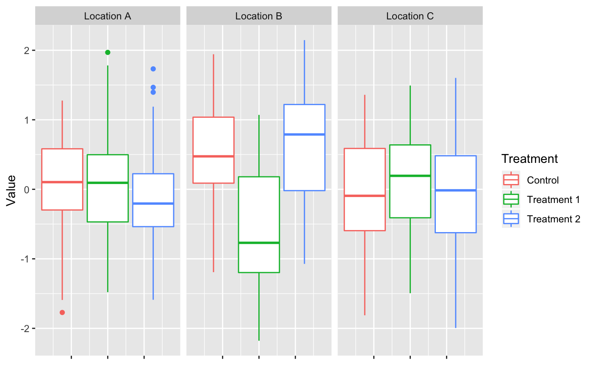

```{r setup, include=FALSE}
library(learnr)
library(gradethis)

knitr::opts_chunk$set(echo = FALSE)
tutorial_options(exercise.checker = gradethis::grade_learnr)


library(downloader) 
library(dplyr)
url <- "https://raw.githubusercontent.com/sowusu08/ANOVA-PlantHeights-Data/master/Data/PlantHeights.csv"
filename <- "PlantHeights.csv" 
download(url, destfile=filename)

PlantHeights <- read.csv("PlantHeights.csv")
LocationC <- PlantHeights %>%
  filter(Location == "C")
  
```


## Topic 1
A recent study tested the effectiveness of two new pre-market fertilizers. To test them (a) 100 corn plants were grown with a fertilizer already in the market (the control), (b) 100 plants were grown with the first new fertilizer (Treatment 1), and (c) 100 plants were grown with the second new fertilizer (Treatment 2). Of theses 300 plants, 50 plants were randomly sampled from each treatment group. Just before harvesting, the stalks of the randomly sampled corn plants were measured and the differences between their heights and the standard stalk height of a healthy corn plant were recorded. 

The researchers then repeated the same procedure at two other locations. The PlantHeight data set contains the results of this study. The boxplots below summarize these results.

{width=80%}


```{r quiz-1, echo=FALSE}
quiz(caption = "Indicate whether the following statements regarding the boxplots are true or false. Assume all assumptions of ANOVA are met.",
  question("Assuming the pooled estimates of the within groups variances of Location B and Location C data are
           approximately the same, we would expect the $F_{obs}$ of the Location B data to be smaller than the $F_{obs}$ of the Location C data",
    answer("True", message = "Under these circumstances we would expect the $F_{obs}$ of the Location B 
           data to be larger because the between groups variance of the Location B data appears to be larger.
           Recall that the F-stat is proportional to the between groups variance."),
    answer("False", correct = TRUE,
                    message = "We are assuming the pooled pooled estimates of the within groups variances are equal. Remember
            that the F-stat is proportional to the between groups variance. So we would expect that the data which appears to have the 
            larger between groups variance will have the larger $F_{obs}$"),
  allow_retry = TRUE,
  random_answer_order = TRUE),
  
  question("It appears that the between groups variance of the Location A data is less than the between groups variance of the Location B data",
    answer("True", correct = TRUE, message = "In this case we can consider the between groups variance to be how the medians of the boxplots in one plot 
            vary from an overall mean line of that plot. It appears that the medians of the Location B plot are more varied around the overall mean line."),
    answer("False", message = "In this case we can consider the between groups variance to be how the medians of the boxplots in one plot 
            vary from an overall mean line of that plot. It appears that the medians of the Location A plot are less varied around the overall mean line."),
  allow_retry = TRUE,
  random_answer_order = TRUE),
  
  question("It appears that the pooled estimate of the within groups variances of the Location A data is less 
           than the pooled estimate of the within groups variances of the Location B data",
    answer("False", correct = TRUE, message = "In this case we can consider the IQR to be a good estimate of the within groups variances.
           In general the boxplots of the Location B data appear to be wider that the boxplots of the Location C data."),
    answer("True", message = "In this case we can consider the IQR to be a good estimate of the within groups variances.
           In general the boxplots of the Location A data don't appear to be as wide as the boxplots of the Location C data."),
  allow_retry = TRUE,
  random_answer_order = TRUE)

)
```


## Topic 2
Using the data set referenced in the previous topic, PlantHeight, complete the following exercise.

Examine the data collected for Location C. Run an ANOVA test in R at the $\alpha = .05$ level. 
```{r grade_code, exercise=TRUE, exercise.lines = 12}
# Run the following line of code to view the Location C data, extracted from the PlantHeight dataframe, that will be used for this exercise 
LocationC

# Run your ANOVA test below!


```

```{r grade_code-hint}
# To print the summary of an ANOVA test run in R, use the following general formula

# NOT RUN
summary(aov(ResponseVariable ~ GroupingVariable, data = dat))

# For information on how to read and interpret this output check out the Resouces tab!
```

```{r grade_code-solution}
# Run the following line of code to view the Location C data, extracted from the PlantHeight dataframe, that will be used for this exercise 
LocationC

# Run your ANOVA test below!
summary(aov(Value ~ Treatment, data = LocationC))

```
```{r grade_code-check}
grade_code("This code is correct. The general formula for printing the output of an ANOVA test in R is summary(aov(ResponseVariable ~ GroupingVariable, data = dat))")
```


```{r conclusion, echo = FALSE}
question("Based on the test output is there sufficient evidence to conclude that there is at least one difference between the group means?",
  
  answer("$p_{obs} < 0.05$ so we reject the null hypothesis and conclude that there is sufficient evidence to suggest
         there is at least one difference among the means",
         message = "Recall that if $p_{obs}$, the number listed under Pr(>F), is less than the alpha value
         there is sufficient evidence to conclude that there is at least one difference between the group means. 
         However, $p_{obs}$ is 0.469 in this case and greater than the alpha value."),
  answer("$p_{obs} < 0.05$ so we fail to reject the null hypothesis and conclude that there is insufficient evidence to suggest
         there is at least one difference among the means",
         message = "Recall that if $p_{obs}$, the number listed under Pr(>F), is less than the alpha value
         there is sufficient evidence to conclude that there is at least one difference between the group means. 
         However, $p_{obs}$ is 0.469 in this case and greater than the alpha value."),
  answer("$p_{obs} > 0.05$ so we reject the null hypothesis and conclude that there is sufficient evidence to suggest
         there is at least one difference among the means",
         message = "The p-value corresponding to the F-stat is 0.469. This is greater than the
         alpha value, .05. Therefore there is NOT sufficient evidence to conclude that there is 
         at least one difference between the group means."),
  answer("$p_{obs} > 0.05$ so we fail reject the null hypothesis and conclude that there is insufficient evidence to suggest
         there is at least one difference among the means",
         correct = TRUE,
         message = "The p-value corresponding to the F-stat is 0.469. This is greater than the
         alpha value, .05. Therefore there is NOT sufficient evidence to conclude that there is 
         at least one difference between the group means."),
  allow_retry = TRUE,
  random_answer_order = TRUE
)

```


